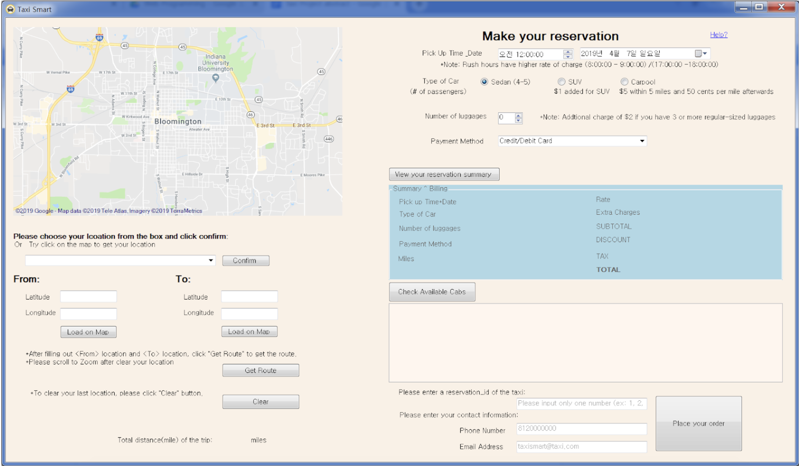

# Taxi-Smart

Taxi-Smart is a team project developed by Camilla, Haein and Neha in Spring 2019, Indiana University, Bloomington.
Language and tools: C#, SQL, Google Map API and Visual Studio.

This business toward application is intented to help users to calculate taxi fare beforehand while also book a cab in advance, especially designed for Hoosier students.

Users can drop pin on map, choose locations/destinations or type in latitude&longitude from dropdown, to preview the route. Then user can choose pick-up time, vehicle type/size, payment method to view total bill. Depending on user's requirements, the application will pull available cabs from the database, and update the database according to user's reservation.

Demo: https://docs.google.com/document/d/18nyFEM8G5xfn7iPvfF78MfbVaLi-aXqfJ3yB3duHG-A/edit?usp=sharing

Project Brief: https://docs.google.com/presentation/d/1M1SpnuZ-Xj_YImgZYcuTopYGkpxR_3356AaRuU5mwsM/edit?usp=sharing
